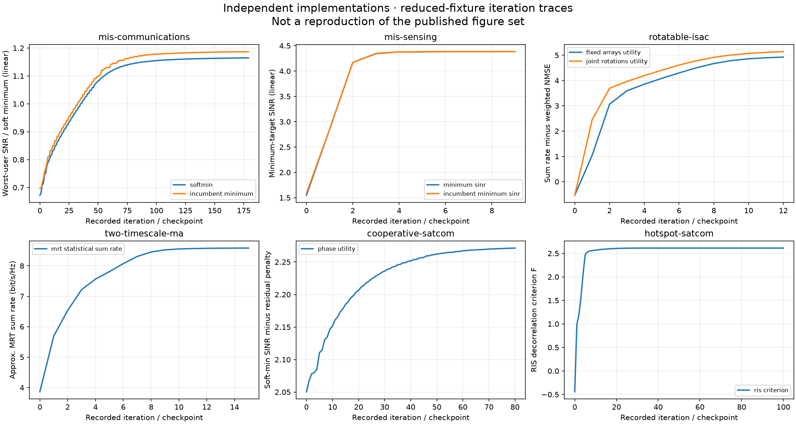

# Wireless paper reproductions

> **Strict-reproduction status (2026-10-04): NOT COMPLETE.** The owner now requires the original theoretical algorithms and full published simulation scenarios, without substitute solvers or reduced dimensions/budgets. The previous `papers/` release does **not** meet that requirement and is retained only as a superseded preview. Its 6/6 parity result is not evidence of strict or complete paper reproduction.
>
> **严格复现状态：尚未完成。** 当前工作位于 [`strict/`](strict/README.md)，以作者提供的 LaTeX 和可获取的作者稿为依据。原文明确规定的模型、算法、场景尺寸与实验预算保留；原文未给出的数值设置按作者授权调试，并在配置中注明来源。最终发表版的一致性尚未核验。之前的 `papers/` 是含替代算法及缩小场景的历史预览，不满足现在的要求。

Independent MATLAB and Python implementations associated with selected technical papers by Ziyuan Zheng and collaborators.

This is not the original private simulation source. Each paper has an explicit implementation scope, equation/source map, shared inputs, executable examples, and validation results. A successful reduced-size run is not evidence that every published figure, Monte Carlo campaign, or hardware experiment has been reproduced.

中文说明：这里公开的是按论文理论重新编写的 MATLAB/Python 双实现，不是原作者私有仿真代码。核心检查、完整尺寸的调试实验与全部图表复现分开记录；通过核心检查不代表完整复现。所有尚未实现的公式、未收敛的运行和调试数值设置均明确列出，不用替代方法补位。

The current correction/execution ledger is [all-paper issues](strict/ALL_PAPERS_ISSUES.md).
It distinguishes proven source errors, reconstruction bugs, numerical repairs,
full-sized cases and unfinished full banks. Neither aggregate dual agreement
nor a completed single case certifies all published figures.

The [full-scene investigation checkpoint](strict/validation/full-scene-audit-checkpoint12-v1/README.md)
adds an actual full-size ISAC raw-PR non-ascent failure, a same-model numerical
cancellation repair checked at all91 cooperative endpoints, and qualifications
to MA stopping/historical-input and saved-benchmark evidence. These actual
findings do not change the incomplete full-reproduction status.

The newer [checkpoint 13](strict/validation/full-scene-audit-checkpoint13-v1/README.md)
adds actual all68 native analytical comparisons, an independent scalar audit of
all7000 saved states in one complete MA instance, retained all183 cooperative
failures, all24 high-precision ISAC terminal checks (including failed additional
stationarity gates), and an unfitted plot from the complete stored900 MA bank.
Each result has an explicit scope; none certifies all papers or all original
figures. Unexpectedly interrupted campaigns retain their data and failure flags.

The [complete MA Figure 3 verification bundle](strict/validation/ma3-complete200-release-v1/README.md)
now has an actually completed fresh one-command test: all200 saved dual-language
cases passed independent physical, original-stop and coordinate-certificate
checks, followed by both Python/MATLAB plots. All1044 archived files are kept in
eight complete parts. This is a runnable saved-result verification package, not
a new optimizer/Monte Carlo run or a claim of close historical figure agreement.
The whole six-paper reproduction remains incomplete.

## Current original-algorithm implementations — work in progress

| Package | Implemented original method | Outstanding full-reproduction work |
| --- | --- | --- |
| [MIS communications](strict/mis-communications) | Product-manifold RCG and smoothing; relaxed scheduling and final hardening | Full sweeps and original-figure agreement |
| [MIS sensing](strict/mis-sensing) | Original RALM/RCG, echo SINR, PSLR and separate closed-form design | Full 6000-start campaigns, convergence and figure agreement |
| [Rotatable-array ISAC](strict/rotatable-isac) | QT/Lipschitz-MM QCQP, raw-PR RCG and PGA/BB rotation | All six schemes and full 100-channel figure banks |
| [Two-timescale MA](strict/two-timescale-ma) | MRT AO/SCA, ZF AO/MM with certified exact coordinate subproblems; explicit original-model Schur/Laplace correction for correlated ZF | Full banks, exhaustive-protocol verification and original-figure agreement; two selected full1000-draw dual precision checks pass |
| [Cooperative SatCom](strict/cooperative-satcom) | Finite-Rician moments, AP/MR QT, RMO and two-stage design | Full converged sweeps and final-version reconciliation |
| [Hotspot SatCom](strict/hotspot-satcom) | Instantaneous QT/SOCP, AO/SDR, original RGD/QT; explicitly corrected vector-QT statistical QoS | Full converged MC, all source panels/counts and independent reference agreement |

Each current package has its own MATLAB entry point, Python entry point, full configuration and source/equation contract. Necessary sign/typographical corrections and numerical safeguards are disclosed, with literal-source diagnostic modes where applicable. No undefined analytical expression is filled in using an unrelated model.

For current dependencies and commands, use the [strict implementation guide](strict/README.md). Actual execution outputs and dual-language comparisons are under [strict/validation](strict/validation); machine-readable status is in [strict/status.json](strict/status.json). **No package has yet passed complete published-figure reproduction.**

To inspect the full original scenario first, then actually run every configured
start for communication Fig7 (not a reduced demonstration):

```sh
python -m pip install -r strict/requirements.txt
python strict/reproduce.py --paper mis-communications --figure 7
python strict/reproduce.py --paper mis-communications --figure 7 --execute --language python --output-dir strict/outputs/full-communication-fig7
```

The first figure command is a read-only plan; `--execute` is a full12000-start
calculation and may take a long time. The explicit two-element axis correction,
all original baselines, stopping failures and reference checks stay visible.
Other figure/language commands are in the strict guide. The newly verified
[native recording and portable runtime entry](strict/validation/mis-communications-native-runtime-subset-v3/README.md)
also separates saved-state replay from a fresh MATLAB optimization run.
Historical preview launchers now refuse to run unless explicitly opted into;
they are never the default route to these original figures.

The [source-qualified parameter-table audit](strict/validation/parameter-tables-source-qualified-v1/README.md)
checks all36 source rows and34 numeric parameter bindings without an optimizer.
For example, `python strict/reproduce.py --paper hotspot-satcom --table 1`
shows the plan; add `--execute` for the canonical-parameter replay. External
pattern references and final-publisher conformance remain explicitly unverified.

Original figures/tables, explicit full-budget execution and independent
reference comparisons now have a [figure reproduction guide](strict/FIGURE_REPRODUCTION.md).
The complete nine-target closed-form beam has actually run in both languages,
with full-grid numerical agreement; its original-figure agreement is still
unverified. A runnable plot must not be confused with a matching original plot.

Latest same-reference phase, explicit-noise-contract and dual-language evidence is collected in [sensing correctness v2](strict/validation/sensing-correctness-v2/); use the figure reproduction guide above to run the full-size plot, while original-figure certification remains pending.

```sh
python -m pip install -r strict/requirements.txt
python strict/validate_components.py --output-dir strict/outputs/components
python strict/rotatable-isac/test_metadata.py
python strict/two-timescale-ma/test_metadata.py
```

These are component and receipt-integrity checks, not full production commands. Full scenarios are separate, potentially expensive runs described in the package READMEs. MATLAB convex subproblems require a separately installed CVX toolbox; MIS and ISAC use base MATLAB.

<details>
<summary>Historical reduced previews — superseded, not the current reproduction work</summary>

## Superseded preview packages (not the strict implementations)

| Package | Paper DOI | Implemented core |
| --- | --- | --- |
| [MIS communications](papers/mis-communications) | [TWC.2025.3621083](https://doi.org/10.1109/TWC.2025.3621083) | Two-layer aperture, exact scheduling, soft-min phase optimization |
| [MIS sensing](papers/mis-sensing) | [JSTSP.2026.3681476](https://doi.org/10.1109/JSTSP.2026.3681476) | Fourth-order echo SINR, exact scheduling, reduced augmented-Lagrangian optimization |
| [Rotatable-array ISAC](papers/rotatable-isac) | [JSTSP.2026.3693227](https://doi.org/10.1109/JSTSP.2026.3693227) | Rotation-aware channels, rate/NMSE model, disclosed alternative AO subsolvers |
| [Two-timescale movable antennas](papers/two-timescale-ma) | [TCOMM.2025.3585515](https://doi.org/10.1109/TCOMM.2025.3585515) | MRT statistical AO/SCA position optimization; ZF evaluation only |
| [Cooperative SatCom](papers/cooperative-satcom) | [JSAC.2024.3460068](https://doi.org/10.1109/JSAC.2024.3460068) | Noncoherent MR LoS limit, RIS phase optimization, restricted power allocation |
| [Hotspot SatCom](papers/hotspot-satcom) | [TWC.2023.3309957](https://doi.org/10.1109/TWC.2023.3309957) | Thesis-cross-checked RIS decorrelation core + separate ZF/QoS baseline; final journal full text pending |

The npj Wireless Technology perspective is not a numerical-algorithm package and is not included. Every package contains `README.md`, `source_map.json`, `fixture.json`, a Python entry point, and a uniquely named MATLAB entry point.

## Preview dependencies

Python 3.10 or later and NumPy. MATLAB implementations use base MATLAB unless a paper README explicitly states otherwise. Optional plotting uses Matplotlib. No proprietary solver or third-party MATLAB toolbox is bundled.

```sh
python -m pip install -r requirements.txt
```

## Run and validate historical previews only

From this repository's root, run all Python examples and checks:

```sh
python scripts/run_python.py --legacy-preview
python scripts/validate_python.py
python -m unittest discover -s tests -v
```

In MATLAB, from this repository's root:

```matlab
addpath('scripts');
run_all_matlab('all', '', true); % explicit superseded-preview opt-in
```

Only after actually running both languages:

```sh
python scripts/validate_parity.py
python scripts/plot_histories.py
```

For one historical preview: `python scripts/run_python.py --legacy-preview --paper mis-communications` and `run_all_matlab('mis-communications', '', true)`. The `outputs/` folder is generated and ignored by Git. The checked-in [validation evidence](validation) records actual local outputs, parity thresholds, runtime versions, and fixture/source SHA-256 hashes. It is not a substitute for running your own changed fixture.

The initial local checks use Python 3.12, NumPy, and MATLAB R2025b. Numerical parity uses absolute tolerance `1e-7` plus relative tolerance `1e-6` on complete outputs, including iteration histories. Machine-scale deterministic tie breaking is documented in the MIS packages. GitHub Actions reruns Python core checks only; MATLAB parity is a separate licensed-runtime local check.



These are newly computed iteration traces, **not published paper figures**. Metrics and units differ between panels and cannot be compared across papers.

</details>

## Scientific scope

- MATLAB and Python use the same input fixtures, rather than assuming different language random generators produce the same samples.
- Tests distinguish model identities, constraint feasibility, numerical gradient checks, optimizer behavior, and cross-language numerical agreement.
- Original measurement data, hardware controls, manuscript files, reviewer correspondence, and private institutional material are excluded.
- Neither convergence to a global optimum nor agreement with every published curve is implied.

## Rights and citations

Please cite the corresponding paper when using its model. This repository does not redistribute the papers or third-party solvers. No open-source license has been selected yet; public visibility alone is not a grant of an open-source license.
