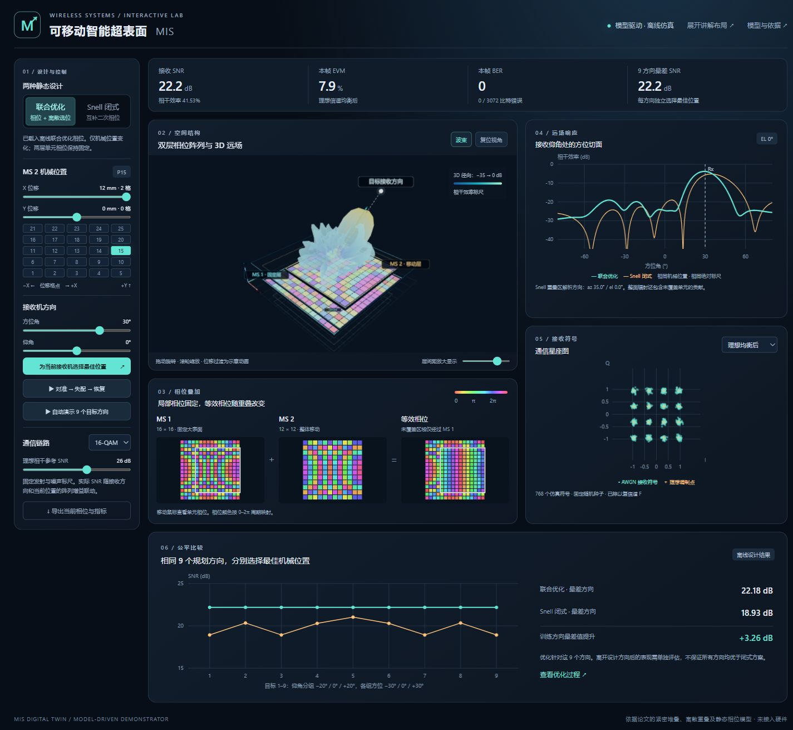

# MIS 3D 数字孪生演示 / MIS 3D Digital Twin Demo

基于论文 **[Movable Intelligent Surface (MIS) for Wireless Communications: Architecture, Modeling, Algorithm, and Prototyping](https://arxiv.org/abs/2412.19071)** 的离线、模型驱动交互演示。通过移动第二层超表面，联动展示两层静态相位、等效孔径、3D 波束、方向图切面及 QPSK / 16-QAM / 64-QAM 通信星座。

> 当前版本是理想标量模型的数值演示，未接入或校准真实硬件；联合优化实现论文的有限样本目标，并非论文原始 RCG 求解器的逐行复现。

本目录用于交互式教学演示，与宿主仓库 `strict/` 中的原算法复现工作分别记录，不改变其复现完成状态。



## 打开演示

- **单文件离线使用：** 下载 [MIS_3D演示.html](MIS_3D演示.html)，用 Chrome 或 Edge 打开；Windows 也可以运行 `启动演示.cmd`。单文件已内嵌所需资源，不需要网络或安装前端依赖。
- **查看与修改源码：** 下载完整仓库，进入 `mis-digital-twin/` 目录；入口为 [index.html](index.html)，需保留其余文件。也可在该目录运行 `node server.cjs`，再访问 <http://127.0.0.1:8769/>。
- **演示顺序：** 选择设计 → 点击“对准 → 失配 → 恢复” → 移动 X/Y 位置 → 切换星座调制方式。两层相位保持静态，机械移动改变叠加后的孔径场。

GitHub 文件预览不会执行 HTML；请下载到本地打开，或使用部署后的静态网站入口。

## 两种设计与计算范围

| 项目 | 实现 |
|---|---|
| 联合静态相位与位置选择 | 精确枚举 25 个候选位置，结合多初值、最差目标平滑和 L-BFGS / Armijo 相位更新；不声称全局最优 |
| Snell 闭式示例 | 互补二次相位经平移在重叠区域形成线性梯度；全孔径波束仍由复场求和计算 |
| 有限孔径 | MS 1 为 16×16，MS 2 为 12×12；单元周期 6 mm，频率 12.2 GHz |
| 规划方向 | 方位角 {−30°, 0°, 30°} × 俯仰角 {−20°, 0°, 20°}，共 9 个方向 |
| 信道与星座 | 法向均匀平面波、理想单位幅度透射、紧密堆叠逐单元相位相乘、单用户窄带信道与 AWGN |

两层相位为 α、β，位置选择矩阵为 Sᵤ，未覆盖区域由 eᵤ 填充为 1：

$$w_u=e^{j\alpha}\odot(S_u e^{j\beta}+e_u),\qquad F_u(\mathbf v)=\frac{1}{256}\sum_m w_{u,m}e^{-j2\pi\mathbf r_m\cdot\mathbf v/\lambda}.$$

离线联合设计的目标为：

$$\max_{\alpha,\beta}\min_{k\in\{1,\ldots,9\}}\max_{u\in\{1,\ldots,25\}}|F_u(\mathbf v_k)|^2.$$

已保存的数据中，两种方法在各方向独立选择最佳位置。参考 SNR 为 26 dB 时，九方向最差接收 SNR 分别为 **18.926 dB（当前 Snell 示例）**和 **22.183 dB（联合设计）**，相差 **3.257 dB**。这只适用于当前 9 个规划方向、25 个位置及指定参数；不是原型实测结论，也不代表优于所有 Snell 设计。此次两种方法最终选择的位置恰好一致，提升来自相位配置改善。

闭式相位是根据 Snell 原理推导的示例，不是论文原型的制造相位表。层间距控制仅改变显示，不改变电磁计算。有限帧 BER 为 0 只表示该帧未观察到错误。

更多推导、参数、操作说明及模型边界见 [说明与模型.md](说明与模型.md)。

## 复现与重新打包

演示本身不需要 Python；重新计算需要 Python 和 [compute/requirements.txt](compute/requirements.txt) 中的 NumPy。重新生成数据会覆盖 `data.js`，验证会更新 `compute/validation.json`。

```sh
cd mis-digital-twin
python -m pip install -r compute/requirements.txt
python compute/generate.py
python compute/verify.py
node bundle.cjs
```

最后一条使用 Node.js，把源码重新打包为 `MIS_3D演示.html`。Windows 也可运行 `compute/reproduce.cmd` 完成生成和数值验证，再运行 `node bundle.cjs`。论文源稿不随仓库分发，也不是计算所必需；本地源稿路径仅用于来源记录。

| 文件 | 用途 |
|---|---|
| `index.html`, `style.css`, `app.js`, `scene.js` | 页面、交互、共享复场和 3D 渲染 |
| `data.js` | 静态相位、方向—位置功率、选位及真实优化过程 |
| `compute/generate.py`, `compute/verify.py` | 离线设计和独立数值检查 |
| `compute/validation.json`, `browser-validation.json` | 随本版本保存的数值与浏览器检查记录 |
| `bundle.cjs`, `server.cjs` | 单文件打包及本地预览 |
| `vendor/three.min.js`, `vendor/THREE-LICENSE.txt` | 随附的 Three.js 及其许可声明 |

已保存检查记录包含 19 项数值检查，以及浏览器与离线数据的 450 个功率值比对。浏览器记录说明了未单独核验的项目，具体以记录为准。

## English overview

This offline, model-driven demonstration visualizes two static-phase metasurfaces, mechanical translation of the second layer, the resulting aperture field and radiation patterns, and QPSK / 16-QAM / 64-QAM constellations. Open the downloaded `MIS_3D演示.html` in a browser, or enter the repository's `mis-digital-twin/` directory and run `node server.cjs`.

The joint design uses exact discrete position selection and multi-start phase optimization for the finite max–min objective. It is **not an exact reproduction of the paper's RCG algorithm**, and no global-optimality claim is made. The closed-form baseline uses complementary quadratic phase masks motivated by generalized Snell's law. Its masks are illustrative, not the prototype's fabrication data.

The saved **3.257 dB** worst-direction improvement applies only to this 9-direction, 25-position simulation and its chosen Snell parameters. The demonstration has **no live hardware connection, measured constellation data, or full-wave calibration**. See the Chinese model notes and included validation records for details.

## 参考文献与第三方依赖

Z. Zheng, Q. Wu, W. Chen, X. Wu, and W. Zhu, “Movable Intelligent Surface (MIS) for Wireless Communications: Architecture, Modeling, Algorithm, and Prototyping.” [arXiv:2412.19071](https://arxiv.org/abs/2412.19071) · [DOI](https://doi.org/10.1109/TWC.2025.3621083).

Three.js 的第三方许可见 [vendor/THREE-LICENSE.txt](vendor/THREE-LICENSE.txt)。本演示目录尚未另行指定项目代码的开源许可证。
