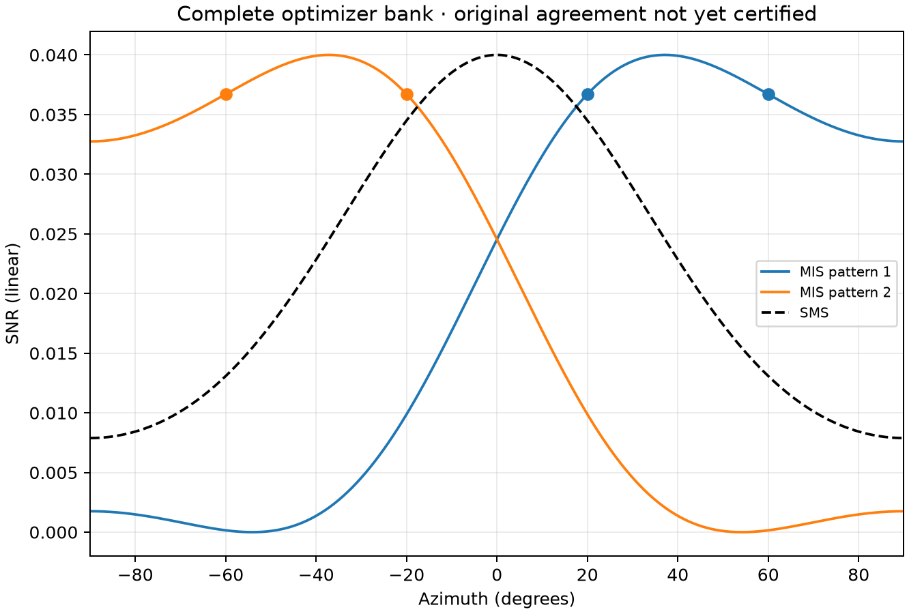

# Complete corrected-axis Fig7 Python execution



`full-result-python.json` is the actual full result, not a reference-ordinate
reconstruction: all6000 MIS starts and all6000 SMS starts, unchanged disclosed
4000 inner cap and1e-6 KKT gate. Every recorded start passes its domain and
convergence checks. Both selected final solver histories and all12000 start
summaries are included. `manifest.json` records the immutable scientific
source, original-size input, RNG, settings and runtime identity. The runtime
runner's separately recorded repair only retries transient Windows file locks;
it does not change numerical calculations or the immutable bank signature.

`original-vector-independent-comparison.json` independently reconstructs
the physical fields of both selected states and compares all three original
EPS paths at all1080 source samples. Maximum absolute linear-SNR error is
**2.572838263652233e-7**, below the predeclared1e-5 gate. No phase, angle,
spacing, gain or reference ordinate is fitted. Original artwork is not
redistributed. Reference values never enter the optimizer.

`all12000-final-states-and-recorded-stops-independent.json` is an actual
completed independent audit of **all12000** raw saved final states, not just
the two selected states. It imports no production solver, independently
rebuilds every final physical metric, binary score, domain and smoothed
KKT residual, and checks all230400 recorded continuation-stop records.
Maximum actual final KKT is9.99994305807773e-7 (original gate1e-6);
maximum independent KKT disagreement is4.2180518252356576e-16.
Every raw file hash, full-result hash and immutable bank/source identity
is bound in the receipt. Intermediate inner states were not saved and are
**not** claimed independently replayed. This audit does not establish a
global optimizer, the literal2x1 model, or the independent full MATLAB bank.

This is the explicitly documented **same-two-element1x2 axis erratum**, not
recovery of the contradictory literal2x1 source text. It is not publisher
approval, an independent complete MATLAB bank, all communication figures,
or an all-paper completion certificate. Source numerical settings that were
not published remain explicitly labelled reconstructed controls.

From the repository root, regenerate the complete bank and its plot:

```sh
python strict/execute_mis_communications.py --figure fig7 --bank strict/outputs/mis-communications/fig7-complete --workers 2 --settings strict/mis-communications/settings.json
python strict/render_figure.py strict/outputs/mis-communications/fig7-complete/full-result-python.json --output-dir strict/outputs/mis-communications/fig7-complete/plots
python strict/freeze_communication_fig7_bank.py --bank strict/outputs/mis-communications/fig7-complete --output strict/outputs/mis-communications/fig7-complete/independent-check.json
```

This performs the full12000 numerical optimizations, not a hidden quick
demonstration. The recorded local two-worker execution took about13043s;
timing is not an author-hardware benchmark. The independent evaluator checks
every actual final state and every recorded continuation stop; intermediate
states were not saved and are not claimed independently replayed.

To redraw the checked-in actual result without re-optimizing:

```sh
python strict/render_figure.py strict/validation/communication-fig7-complete-python-v1/full-result-python.json --output-dir strict/outputs/mis-communications/fig7-verified-redraw
```

A redraw is explicitly **not** a fresh optimizer execution.
