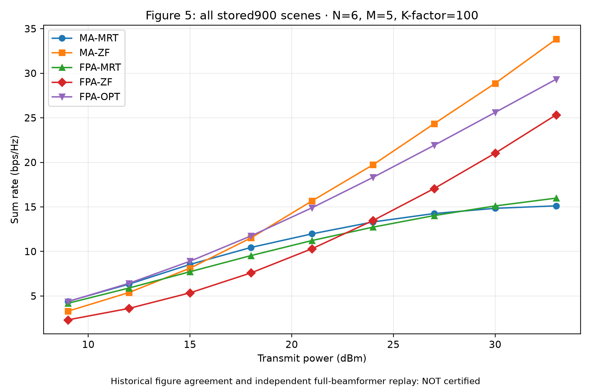

# Full-scene audit checkpoint 13 — verified scopes and retained failures

**2026-10-04 · All six papers / all published figures: NOT COMPLETE.**

本页发布已经实际完成的检查以及没有通过的项目。它不是“六篇全部复现成功”声明，也不把中断的长运行、保存数据绘图或源码检查当成完整数值复现。早期失败记录未删除、未改成通过；原论文模型、场景规模和随机样本数量没有为了通过检查而缩小。

## 实际完成的检查

| 对象 | 本次已经核验的完整范围 | 仍不能据此宣称的范围 |
| --- | --- | --- |
| MIS sensing 闭式分析 | 全部 68 个分析点的 MATLAB 保存结果、Python 结果与独立标量物理计算一致；68/68 通过。错误的共轭处理负对照在 68/68 点产生差异 | 全 6000-start RALM 优化、全部论文图表、历史曲线一致性、形式化区间证书 |
| Two-timescale MA 首个完整实例 | 7 个方法各 1000 个保存末态，共 7000 个末态、35000 个用户 SINR；独立检查功率、泄漏、速率以及原停止条件，全部通过。3000 个 FPA 停止记录与两条 MA 轨迹均保留 | 新生成的随机集合、任意波束方向的完整梯度证书、每一个内部 QCQP、全部 300 个实例、历史曲线 |
| Cooperative SatCom | 对全 183 个既有实例、15 组扫描、8362 个相位阶段及 417910 个坐标记录完成只读故障分解 | 新的物理计算、稳定增量全域验证、修复后的全 183 cold run、MATLAB 完整对照 |
| Rotatable-array ISAC | 对 24 个完整 W 子问题末态实际运行 MP80/MP100 独立原模型检查；原场与跨精度计算全部通过；采用更紧 `1e-12` 相对停止阈值的 12 个控制实例均满足其声明的停止条件 | 完整 AO、每一个中间 QCQP、全部 100-channel / 所有方案图表；额外的 `1e-6` 驻点精度检查没有通过 |
| MA Figure 5 | 已存在的全部 900 个场景、5 个方法各 1000 个保存速率值，共 4500000 个值，完整聚合并绘图，没有筛掉失败或强制曲线排序 | 新的独立波束物理复核、完整 MATLAB 900 场景对照、原发表图的接近程度；保存数据原执行的 I/O exit1 仍保留 |

MA 首个实例的最大独立和速率差约为 `8.17e-14`。观察到的最大总功率为 `1.0000000000000009`，满足该运行原有的 `1e-6` 数值容差；没有把容差改宽。

## 具体问题与归属

1. **重写代码 / 验证环境问题，而非论文理论错误。** 原 native68 比较入口假定 Windows 的 `math` 必有 `__file__`，因此旧入口异常退出。新的独立版本只修正运行时来源观察，保留原标量物理函数；实际全 68 比较已通过。旧失败保留。

2. **Cooperative MR 数值消减，仍未完成全域修复验证。** 此前多精度检查中 181/183 实例的四项分量检查通过，两例仍存在梯度不一致。只读分解发现 AP 的 1072 个逐位 replay 标志为 false，MR-S 的 12 个阶段与 MR-TTS 的 4 个阶段存在既有梯度失败。只有两例已经实际证明与数组布局有关，不能推广为全部失败的原因。正项 Wick 重写属于同一有限-Rician 模型的数值实现修复，不是替代模型；完整有限增量、cold-run 及双语言检查尚未完成。

3. **ISAC 相对停止不等于更强的物理驻点保证。** 12 个更紧阈值控制确实满足原相对停止规则，但全部 24 个末态仍未达到额外声明的归一化 `1e-6` 物理驻点检查。这是需要继续解释与处理的精度问题。额外检查不是原文给定的固定停止门槛；不能仅凭此宣布原论文公式有错，也没有改大检查阈值让它通过。

4. **MA Figure 5 完整数据不等于完整证书。** 原保存运行的 I/O 失败不能被事后读取或绘图改成成功退出。下图只是全量保存数据的原值显示。MA-MRT 在 30/33 dBm 低于 FPA-MRT 的结果原样保留；没有拟合增益或人为保证 MA 曲线占优。

完整已有问题分类见 [all-paper issues](../../ALL_PAPERS_ISSUES.md)。上述新增证据限定相应结论，不撤销其中尚未完成的工作。

## 完整保存数据图（不是原图一致性证书）



[Vector SVG](ma-figure05-complete-stored900.svg)。图中 N=6、M=5、Rician K-factor=100；9 个功率点均使用 100 个几何实例，每个方法每个几何实例 1000 个保存速率值。这是 4500000 个保存速率值，不是新抽取的 4500000 个独立信道。

## 可检查的公开记录

[Machine-readable verified scopes and retained failures](actual-verified-scope-and-retained-failures.json) 是经过逐项原记录校验的元数据投影，不包含私人论文文件、机器绝对路径或完整原始运行数据。

SHA-256:

```text
actual-verified-scope-and-retained-failures.json
a04dfe71765f5f6651f9f9d07a263c50874264feae9065854817ad426ed221ab
ma-figure05-complete-stored900.png
14982680ab69a45c5305ce8285640cc2e37927f2676b3616230783c7aaeee72d
ma-figure05-complete-stored900.svg
3ac787093420c7a4fbc18ca19bd565b9b39a192daba9dfd60f1ba6b1800f4bf7
```

本次仅澄清了三处指数标签，把容易混淆的 `1e12` / `1e6` 写成 `1e_minus_12` / `1e_minus_6`；原检查数值和 true/false 判定不变。原投影及原完整记录的哈希均保留在公开记录内。

部分长运行进程曾意外结束。已完成证据与中断位置保留；恢复时必须重新核对源、输入和已保存病例，不能把失去的进程句柄或启动动作当成成功。完整 MA 200 实例的“一条命令核验、解包、独立检查、绘图”已使用全新输出重新执行；在全部实例与真实完成记录通过前，不将其称为已验证的端到端发行版。

**This checkpoint publishes completed bounded checks and actual failures. It does not certify full six-paper reproduction, complete native optimization campaigns, original historical inputs, or agreement with all published curves.**
