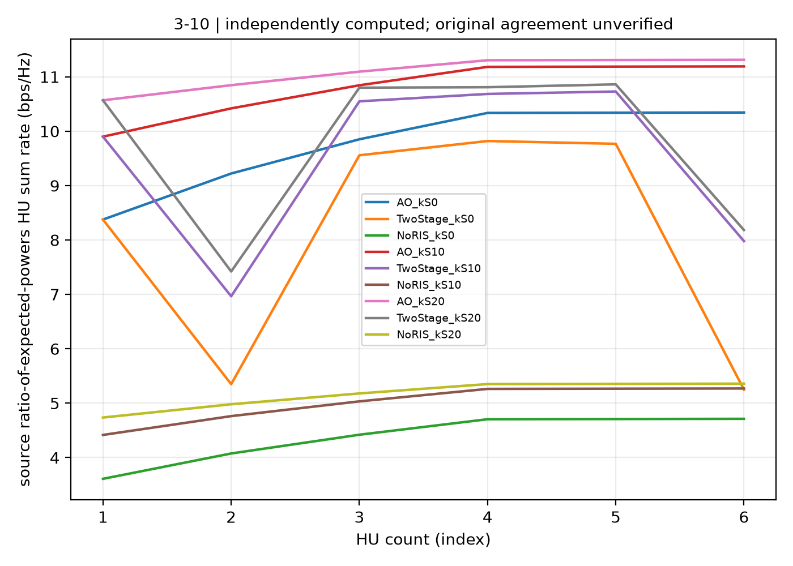

# Actual complete statistical-CSI implementation evidence

`independent-complete-scope-receipt.json` independently verifies the actual full Python run, not a planned run or a synthetic reference-curve reconstruction:

- All 18 `(U=1..6, beta=0/10/20 dB)` cases, with original 16 feeds/streams and 25 subpanels.
- All 243 declared `0..U` starts across NoRIS, TwoStage and AO; each required start reaches its original gradient `1e-6` and/or relative improvement `1e-4` stopping rule. Failed or capped starts cannot be discarded.
- Independent original statistical-moment metric, power and NHU average-SINR checks for every final design, and independent final phase-gradient checks.
- All 54 selected fixed statistical designs receive the same 1000 fresh paired channel draws per case. Every one of the 54000 actual rate samples is replayed from its declared seed, including the sample means, standard errors and empirical expected powers. This is not an optimized instantaneous-CSI Monte Carlo bank.
- Original-run/current-source binding, independent-audit source interval, SHA-256 of the full native result and all 261 actual case/start checkpoints.

`manifest.json` binds the public receipt and the actual executing scientific source hashes. Large native histories and raw simulation files remain runtime outputs, with hashes retained here; no author manuscript, private path or original figure artwork is included.

This evidence certifies the **declared mathematically corrected implementation scope**, not the literal invalid printed statistical QoS/SOC branch. It preserves explicit `full_reproduction_pass=false`, original-publisher conformity and original-curve agreement unverified, historical author coordinates/mean phases not recovered, and all-original-source-constraints verification false. The disclosed fixed 10 m-radius polygon only certifies the specific 10–20 m pair-distance contract. The implemented physical ESA power convention and general finite-Rician moment interpretation must not be advertised as a recovered historical author simulation.

Regenerate the independent receipt with `python strict/freeze_hotspot_statistical_validated18.py` from the repository root. This performs no optimization and does not change the frozen numerical sources or native result.

`computed-figure10.json` and its plotted PNG/SVG contain the actual54
ratio-of-expected-powers ordinates, with source-result and renderer hashes.
The separately stored fresh `E[log]` Monte Carlo metric is not silently used
instead. `all54-unfitted-reference-comparison.json` compares all nine curves
and all54 original points against the actual original EPS, SHA256
`fbcd024a896c49dcba58973df0bd42c06700f96911212ff3324ab9c846cfaa93`.
Maximum error is **8.008012646848087 bit/s/Hz**, so original figure agreement
has **not** passed. Original artwork is not included. Reference ordinates
never enter an optimization; real non-monotonic TS values remain visible.
