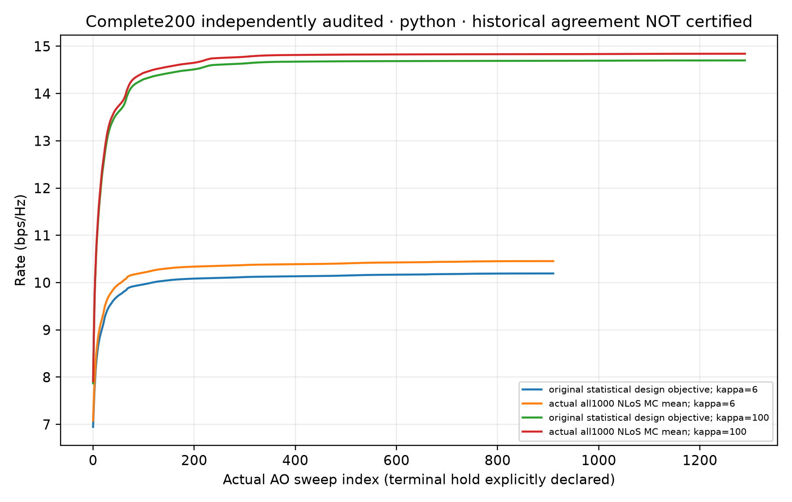
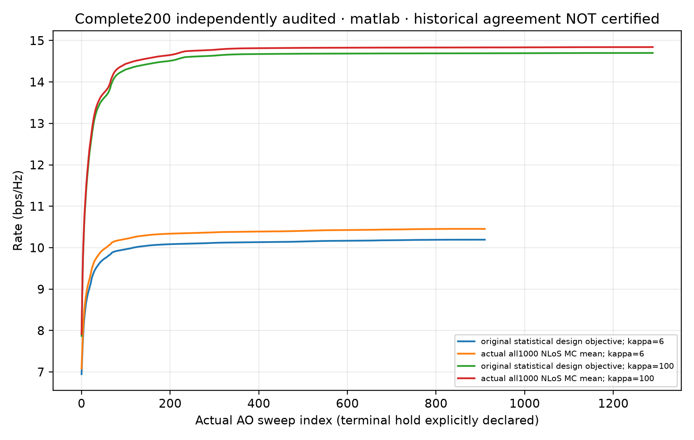

# Verified complete MA Figure 3 saved-dual package

On 2026-10-04, the actual fresh one-command run verified and unpacked the
complete eight-part archive, independently checked **200/200 cases with zero
failed cases**, and then generated both language-specific figures. All1044
archived files and all immutable support sources remained unchanged.

Use the [complete standalone bundle](../ma3-complete200-portable-v1/).
From that directory, install its observed dependencies and run:

```text
python -m pip install -r requirements.txt
python -B verify_full200.py --verify-unpack-audit-render --new-output ../ma3-fresh-verification
```

The output must be completely new. The audit runs before plotting; incomplete
or failed cases cannot be filtered out to produce the figure. The command
retains all100 geometries for each of the two parameter cases, all1000 NLoS
draws per geometry, accepted MRT/ZF positions, five benchmark families and
original coordinate-subproblem certificates. Different nonconvex trajectories
do not have to coincide; each language's own states must pass the same physical
and original stopping checks.

The immutable bundle's README still contains its historical preparation-status
paragraph because it is itself byte-bound evidence. The present release receipt
records the subsequent actual complete execution without rewriting that history.

## Actual outputs and verification

- [Machine-readable execution certificate](execution-certificate.json).
- [Fresh full200 independent numerical summary](actual-full200-dual-summary.json).
- [Actual one-command completion](actual-single-command-completion.json).
- [Actual whole-archive/source completion](portable-audit-completion-byte-binding.json).
- [Complete plotted curve data](portable-all200-Fig3-curves.json).
- [Python PNG](portable-Fig3-python.png) and [SVG](portable-Fig3-python.svg).
- [MATLAB PNG](portable-Fig3-matlab.png) and [SVG](portable-Fig3-matlab.svg).





## What this does not certify

This command rechecks actual saved MATLAB/Python results; it does **not** run a
new native MATLAB optimization or generate a new random ensemble. The original
figure comparison remains unresolved, so **close agreement with the paper is
not claimed**. Declared geometry counts, seeds and unreported numerical controls
are not presented as the author's recovered historical settings. This package
does not certify global nonconvex optimality, all unpublished intermediate
matrices, the paper's other figures, or completion of the six-paper project.

All earlier failed and interrupted local outputs remain retained. No private
full manuscript, credentials, runtime or solver binaries are included.
