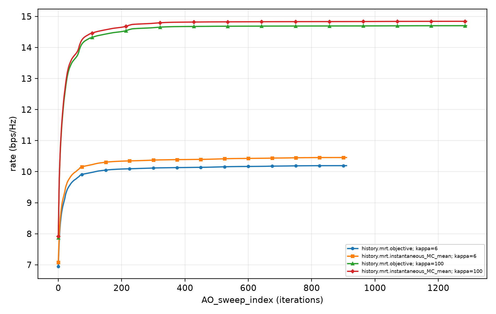

# Actual MATLAB Fig. 3 full200 evidence

This package records a **completed MATLAB run and two independent all200 numerical audits**, not recovery of the historical published curves. The same-input full Python200 bank was still unfinished when this package was frozen. Other figures and papers are not certified by this receipt.

The run retains the paper's Fig. 3 dimensions and operating parameters: N=6, M=5, kappa=6/100, full aperture A=2 wavelengths, spacing lambda/2, and power 1 W. Each kappa uses all 100 configured geometries and each geometry all 1000 configured NLoS draws. The paper does not disclose these Monte Carlo counts, the seed, or the historical convergence-curve aggregation, so these are explicitly reconstruction controls, not recovered author settings. The unreported AO safety cap is 10000; the paper's fractional-increase stopping threshold remains 5e-5.

## What passed

- All 200 actual MATLAB cases, their input identities, and execution-time source/runtime identity checks.
- Fresh independent physical evaluation of all five schemes for every one of the 1000 original draws in every case, plus original stopping and power constraints.
- Every accepted MRT and ZF position, all 1000 draws at each position, design-objective identities, original AO stopping gates, and position/linearized-spacing constraints.
- Every ordered coordinate update: an independent reconstruction of its concave minorant, gradient, full spacing/box polygon, and conservative global tangent gap bound. Invalid log-domain vertices are never evaluated in the logarithmic objective; they are used only in the affine tangent bound.

The coordinate certificate is global for the **individual concave subproblem**. It does not certify global optimality of the nonconvex outer position-design problem. Exact counts and maximum errors are in [audit-summary.json](audit-summary.json); the full per-case physical and certificate receipts are preserved here byte-for-byte.

## Actual graph and aggregation

[Vector graph](two-timescale-ma-matlab-figure-03.svg), [all four complete curve arrays](two-timescale-ma-matlab-figure-03.json), and [renderer readiness](readiness.json) are original generated artifacts, not fitted curves. The JSON is 189912 bytes and contains every plotted sample. Every geometry is retained with equal weight. Once a trajectory stops, its last accepted state is held for later plot abscissae; that hold is not an extra executed update.

The final-state histogram mean is not the plotted mean at iteration 600: some actual trajectories continue past that abscissa. For kappa=6 the final MC mean is 10.4546165 bit/s/Hz versus the displayed iteration-600 mean 10.4264927; for kappa=100 the values are 14.8421297 and 14.8275619. This is a protocol difference, not selection of a favorable geometry. The complete distribution audit is [the ensemble receipt](full200-matlab-Fig3-ensemble-protocol-audit-v1.json).

## Historical-curve discrepancy remains

All four original EPS vector paths were compared without vertical scaling, offset, power/noise fitting, geometry selection, removal, or reweighting. Original storage indexing is undisclosed, so [the indexing-v2 comparison](full200-matlab-original-Fig3-unfitted-vector-comparison-indexing-v2.json) preserves both prior conventions rather than selecting the smallest error. Actual-rate RMS discrepancies are approximately 1.582–1.587 bit/s/Hz for kappa=6 and 3.685–3.692 bit/s/Hz for kappa=100. Therefore `original_curve_closeness_verified` remains **false**. The original author's plotted endpoint lying inside the configured geometry distribution is not proof of a single historical geometry or a unique explanation of the difference.

The earlier fixed-index [comparison-v1](full200-matlab-original-Fig3-unfitted-vector-comparison-v1.json) is retained as historical evidence, with its +1 indexing identified as a declared assumption, not a verified author protocol. No private manuscript, EPS, original figure image, or raw channel input is published here.

## Identity and verification

[freeze-manifest.json](freeze-manifest.json) binds every published file and all 200 original input-byte hashes, input fingerprints, and actual raw-output hashes, together with the original outer execution receipt and both independently predeclared audit freezes. [The compact runtime identity](execution-runtime-source-identity-compact.json) retains actual MATLAB/BLAS/LAPACK versions and source hashes; only workspace-absolute source paths were redacted to repository-relative paths. This does not claim complete runtime-binary hashing or the same runtime as the superseded bank. Original raw files were not changed.

From this folder, `python verify_package.py` verifies all public hashes and consistency gates without private files, MATLAB, or numerical reruns. It checks the preserved evidence package; it does not itself reproduce the 200 scenarios. To rerun the scientific pipeline, use the repository's main [run instructions](../../../README.md) and the exact [executed configuration](executed-run-config.json). The adjacent [independent audit scripts](../two-timescale-ma-corrected-zf/) require the original complete input/output banks for fresh numerical checking.

旧版失败和未完成结果均保留；本包的“通过”仅限上述 MATLAB 完整场景与独立检查，不代表原图已经严格贴合，也不代表六篇论文全部完成。
